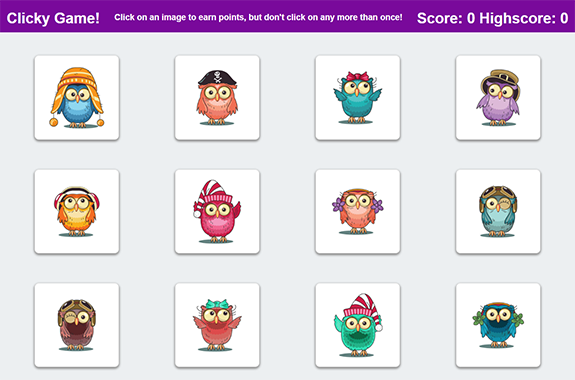

# Clicky Game!
> This project was bootstrapped with [Create React App](https://github.com/facebook/create-react-app).
## Deployed App
https://clicky-game-final.herokuapp.com/

## Table of contents
* [General info](#general-info)
* [Screenshots](#screenshots)
* [Technologies](#technologies)
* [Features](#features)
* [Status](#status)
* [Inspiration](#inspiration)
* [Contact](#contact)

## General info
A fun Bootcamp project to create a simple click game. Click on each image only once, but be careful! The cards shuffle after every click!

## Screenshots
 

## Technologies
* React
* JavaScript
* Bootstrap

## Code Examples
    shuffleArray = array => {
        for (var i=array.length -1; i > 0; i--) {
          var j = Math.floor(Math.random() * (i+1));
          var x = array[i];
          array[i] = array[j];
          array[j] = x
        }
        return array;
    };

## Features
List of features ready and TODOs for future development:
### Features
* 12 adorable owls to click on.
* Endless fun and chances to get the high score!
### Future Development
* Polish site design.

## Status
Project is: _finished_

## Inspiration
Inspired by a set of cute owl vector files I ran across online.
Based on the clicky-game assignment for The Coding Bootcamp at UT Austin.

## Contact
Created by Elise Hammons - feel free to contact me!
 [LinkedIn](https://www.linkedin.com/in/elise-h-01243258/)